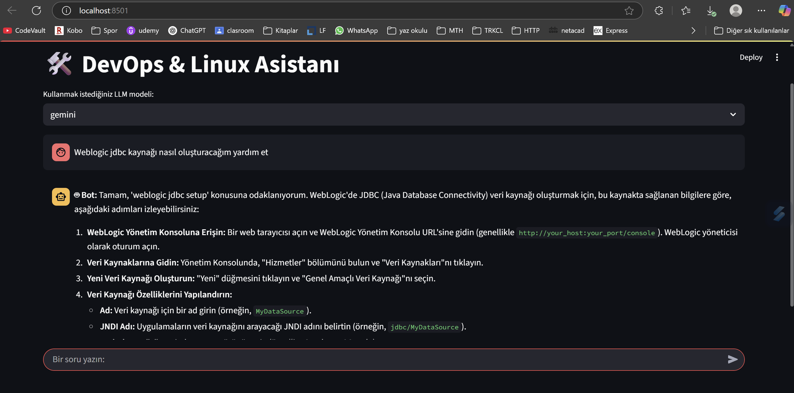

# 🛠️ DevOps & Linux Chatbot

## 📌 Projenin Amacı
Bu proje, DevOps ve Linux konularında sıkça sorulan sorulara yapay zeka destekli yanıtlar verebilen bir sohbet botu geliştirmeyi amaçlamaktadır. Sistem, kullanıcının sorduğu sorunun hangi intent'e ait olduğunu anlamaya çalışır ve buna göre ya hazır yanıtlar döner ya da vektör veritabanı ile LLM (Büyük Dil Modeli) tabanlı bir yanıt üretir. 

Geliştirilen sistem aynı zamanda kullanıcıya yardımcı olacak örnek cümleleri barındıran geniş bir veri seti kullanır. Bu sistem; veri sınıflandırma, bilgi getirme ve doğal dil işleme teknolojilerini bir araya getirerek pratik bir etkileşim sağlar.

Devops, Linux, Network ve Weblogic Server hakkında yazılmış olan toplam 10 kitap üzerinden bilgi getirebilen bir sistem tasarlanmıştır. Burada temel amaç sistem yönetimi ve devops alanında çalışan mühendislere kaynak sağlamak ve troubleshooting süreçlerinde ihtiyaç duydukları bilgileri hızlı ve güvenilir şekilde elde edebilmelerine destek olmaktır.

## 🚀 Proje Nasıl Çalışır?
- Kullanıcı bir soru yazar.
- Cümle önce SentenceTransformer ile vektöre dönüştürülür.
- Logistic Regression + SVM modelleri ile intent tahmini yapılır.
- "Selamlama", "Teşekkür", "Veda" gibi özel intent'ler için sabit yanıt verilir.
- Diğer durumlarda RAG zinciri çalıştırılır.
- LLM (Gemini, OpenRouter destekli) model ile son yanıt oluşturulur.

## 📊 Veri Seti Hakkında
- Veri seti, elle oluşturulmuş kapsamlı bir "utterance-intent" eşleştirmesinden oluşur.
- Sınıflandırılabilir örnekler Türkçe ve İngilizce olacak şekilde çeşitlendirilmiştir.
- Kaggle üzerinde yayımlanmıştır: [Linux & DevOps How-To Intent Dataset](https://www.kaggle.com/datasets/mertbaytas/linux-and-devops-how-to-questions-intent-data/)
- Veri seti, sınıflandırma modeline uygun olacak şekilde ön işleme ve temizleme adımlarından geçirilmiştir. Kategoriler dengeli, etiketler tutarlıdır.


Toplamda **40 farklı intent** tanımlanmıştır ve her biri için yaklaşık **90 örnek cümle (utterance)** oluşturulmuştur. Yani toplamda 3500'den fazla örnek içerir. Kullanıcı girişi önce intent sınıflandırma modeli ile analiz edilir, özel yanıtlar varsa verilir, aksi halde ilgili teknik içerik vektör veritabanından alınarak cevap üretilir.

## 📚 Kullanılan Kaynak Kitaplar

Bu projede, bilgi getirme (retrieval) sistemi için kullanılan vektör veritabanı, aşağıda listelenen teknik kitaplardan elde edilen içeriklerle oluşturulmuştur. Bu kaynaklar, DevOps, Linux sistem yönetimi, SRE ve altyapı yönetimi konularını kapsamaktadır.

| Kitap Adı                                              | Yazar(lar)                          | Sayfa Sayısı |
|--------------------------------------------------------|-------------------------------------|--------------|
| The Linux Philosophy for SysAdmins                     | David Both                          | 269          |
| The Practice of System and Network Administration Vol.1| Thomas A. Limoncelli, et al.        | 536          |
| The Practice of System and Network Administration Vol.2| Thomas A. Limoncelli, et al.        | 552          |
| The Practice of System and Network Administration Vol.3| Thomas A. Limoncelli, et al.        | 552          |
| DevOps for the Modern Enterprise                       | Mirco Hering                        | 193          |
| WebLogic Server 12c: Administration Handbook           | Sam R. Alapati                      | 744          |
| Seeking SRE: Conversations About Running Production    | David N. Blank-Edelman (Ed.)        | 411          |
| Infrastructure as Code: Managing Servers               | Kief Morris                         | 362          |

> 🔍 Bu kaynaklar, Chroma vektör veritabanı içine gömülerek LangChain üzerinden çağrılabilir hale getirilmiştir. Her yanıt gerektiğinde ilgili belge parçasıyla ilişkilendirilir.

---

## 🔌 Kullanılan LLM Modelleri ve API Entegrasyonu

Bu projede iki farklı büyük dil modeli (LLM) ile chatbot eğitimi ve yanıt üretimi gerçekleştirilmiştir:

### 📍 1. Google Gemini (`gemini-2.0-flash`)
**API Sağlayıcı:** Google Generative AI  
**Neden Seçildi:**
- Google'ın güncel ve hızlı çalışan modellerinden biridir.
- Ücretsiz API erişimi mevcuttur.
- Yanıtları hızlı, kısa ve güvenilir döndürme eğilimindedir.

**Kullanım:**
- `.env` dosyasına `GOOGLE_API_KEY` girilerek aktif edilir.
- LangChain üzerinden `ChatGoogleGenerativeAI` sınıfı ile entegre edilmiştir.

### 📍 2. OpenRouter (`mistral-7b-instruct` gibi modeller)
**API Sağlayıcı:** OpenRouter.ai  
**Neden Seçildi:**
- Farklı modelleri bir arayüzden çağırabilme esnekliği sunar.
- ChatGPT, Mistral, Claude gibi birçok açık model desteklenir.
- Gemini ile karşılaştırmalı test yapma imkânı sağlar.

**Kullanım:**
- `.env` dosyasına `OPENROUTER_API_KEY` girilerek aktif edilir.
- LangChain `ChatOpenAI` sınıfı ile `base_url` üzerinden erişim sağlanır.


### 🔧 Kullanılan Araçlar
- **LangChain**: Zincir yapıları, retriever ve LLM entegrasyonları için kullanıldı.
- **Chroma**: Vektör tabanlı içerik veritabanı olarak seçildi.
- **Streamlit**: Kullanıcı arayüzü için kullanıldı.
- **Sentence-Transformers**: Intent sınıflandırma için embedding üretildi.
- **Scikit-learn**: ML modeli olarak Logistic Regression kullanıldı.

---

## 🧠 Chatbot Akışı Tasarımı
Chatbot aşağıdaki temel intent türlerine yanıt verecek şekilde tasarlanmıştır:

- `greeting`: Selamlama
- `farewell`: Vedalaşma
- `thank_you`: Teşekkür
- `off_topic`: Konu dışı mesajlar
- `unknown`: Anlaşılamayan sorular
- `*`: Teknik komut ve yapılandırma soruları (örneğin `linux_process_kill`, `dhcp_server_setup`, `lvm_extend_volume`, vb.)

---

## 📷 Uygulama Arayüzü
Streamlit tabanlı arayüz, kullanıcıların metin girişine yanıt alabilecekleri basit ve anlaşılır bir yapı sunar. Örnek arayüz görüntüsü:



---

## ⚙️ Kurulum Adımları (Python venv ile)

Aşağıdaki adımları izleyerek projeyi lokal ortamınızda çalıştırabilirsiniz:

### 1. 🔽 Projeyi Klonlayın
```bash
git clone https://github.com/kullaniciadi/devops-chatbot.git
cd devops-chatbot
```

### 2. 🐍 Sanal Ortam Oluşturun ve Aktif Edin
```bash
# Sanal ortam oluştur
python -m venv venv

# Windows için:
venv\Scripts\activate

# macOS / Linux için:
source venv/bin/activate
```

### 3. 📦 Gereksinimleri Yükleyin
```bash
pip install -r requirements.txt
```

### 4. 🔐 Ortam Değişkenlerini Ayarlayın
Proje kök dizinine `.env` adında bir dosya oluşturun ve API anahtarlarını ekleyin:
```env
GOOGLE_API_KEY=your_gemini_api_key
OPENROUTER_API_KEY=your_openrouter_api_key
```

### 5. 🧠 ML Modelini Eğitin (İsteğe Bağlı)
```bash
python train_intent_classifier.py
```
Bu komut, intent verilerini kullanarak sınıflandırma modeli (Logistic Regression + SVM) eğitir ve en iyi sonucu veren modeli `models/` klasörüne kaydeder.

### 6. 💬 Chatbot Arayüzünü Başlatın
```bash
streamlit run app/chatbot_app.py
```
Tarayıcınızda açılan arayüzde chatbot'u kullanmaya başlayabilirsiniz.

---

## 📁 Proje Dizin Yapısı (tree)
```bash
├── images/
│   └── devops_chatbot.png
├── data/
│   └── intent.csv
├── models/
│   ├── intent_classifier.pkl
│   └── label_encoder.pkl          
├── vectorstore/
│   └── chroma/
│       ├── chroma.sqlite3
│       └── *.json/*.pkl
├── README.md
├── requirements.txt
├── build_vectorstore.py
├── chatbot_app.py
├── embedder.pkl
├── intent_model_utils.py
└── train_intent_classifier.py
```
---
